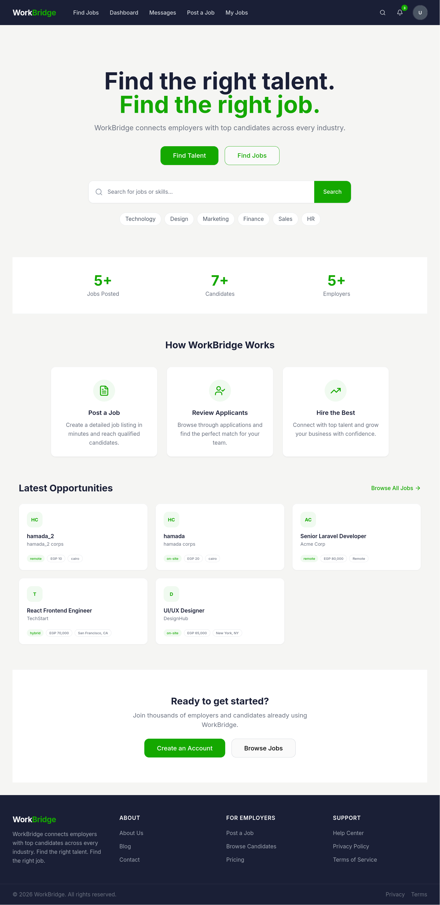
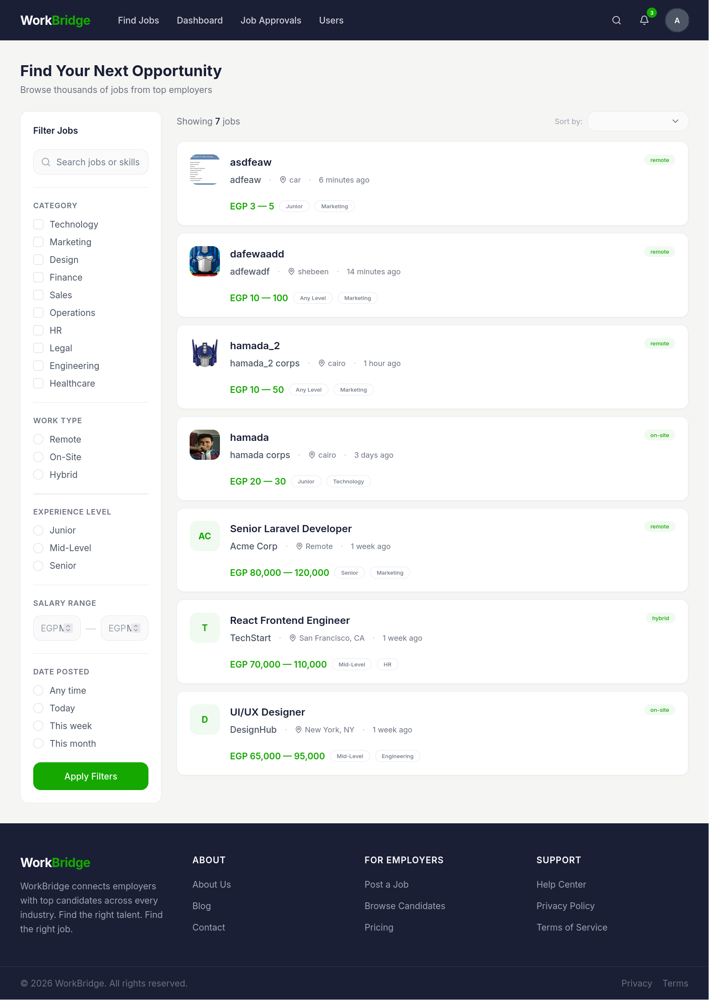
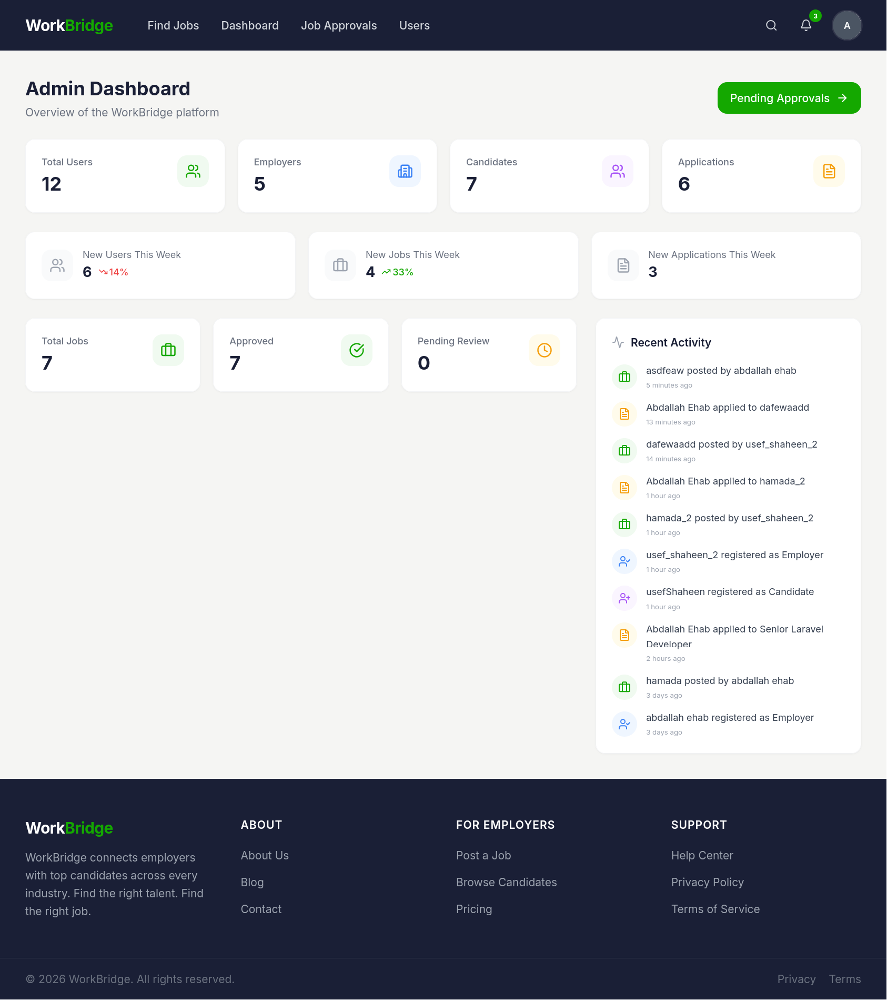

# Job Board

A multi-role job board platform built with Laravel, Inertia.js, and React. Employers can post job listings, candidates can browse and apply, and administrators oversee approvals and user management.


---

## Features

- **Multi-Role Authentication** -- Registration and login with role selection (employer, candidate, admin). Email verification, password reset, and rate-limited login.
- **Public Job Listings** -- Browse approved jobs with keyword search, filters by work type (remote/on-site/hybrid), location, category, salary range, and date posted.
- **Employer Dashboard** -- Create and manage job listings with rich forms (company logo upload, salary range, experience level, deadline). View applicants and accept or reject applications.
- **Candidate Dashboard** -- Apply to jobs with resume upload, save jobs for later, track application status (pending/accepted/rejected), and withdraw pending applications.
- **Admin Panel** -- Approve or reject pending job listings with rejection reasons, manage users (view, ban, unban).
- **Real-Time Messaging** -- Conversation-based messaging between users powered by Laravel Reverb and Laravel Echo.
- **Email Notifications** -- Queued email delivery for job approval, rejection, and application status updates.
- **Role-Based Middleware** -- Three dedicated middleware classes (`EnsureEmployer`, `EnsureCandidate`, `EnsureAdmin`) protect role-specific routes.

---

## Tech Stack

Laravel 13, React 18, Inertia.js 2, Tailwind CSS 3, Radix UI, Laravel Reverb, SQLite/MySQL, Vite.

---

## Quickstart

```bash
git clone <repository-url> && cd job-board
composer install
cp .env.example .env && php artisan key:generate
php artisan migrate
npm install && npm run build
php artisan db:seed        # optional
php artisan serve
```

Development (all services concurrently):

```bash
composer run dev
```

Testing:

```bash
composer run test
```

---

## Screenshots

| Page | Preview |
|------|---------|
| Home Page |  |
| Job Listings |  |
| Employer Dashboard |  |
| Candidate Dashboard |  |


---

## License

MIT
